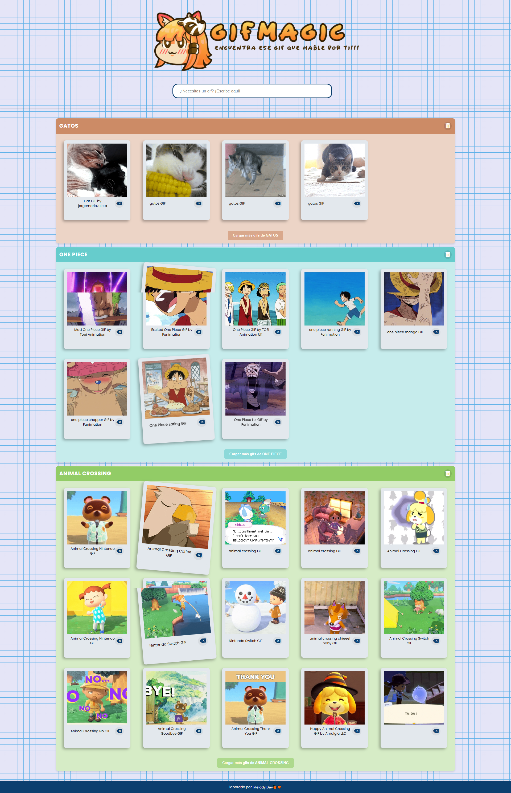

# GifMagic ✨

## 📝 Descripción
Este proyecto comenzó como un ejercicio del curso "React: De cero a experto ( Hooks y MERN )", donde la consigna era crear una aplicación básica para buscar GIFs usando la API de Giphy. 

**🚀 Mejoras personales implementadas:**
He expandido significativamente la funcionalidad base del curso, agregando las siguientes características:

- 🗑️ **Sistema de gestión de GIFs y categorías**
  - Eliminación de GIFs individuales
  - Eliminación de categorías completas
  - Persistencia de datos con LocalStorage

- 🔄 **Mejoras en la experiencia de usuario**
  - Carga dinámica de más GIFs en la misma categoría
  - Sistema de colapso/expansión de categorías
  - Copia de URLs de GIFs con un solo click
  - Mensajes de confirmación al copiar URLs
  - Diseño responsive optimizado


## 🚀 Características
- 🔍 Búsqueda de GIFs por categoría
- 🗑️ Eliminación de GIFs individuales y categorías completas
- ➕ Carga de más GIFs en la misma categoría
- 📦 Persistencia de datos con LocalStorage
- 📋 Copia de URLs de GIFs con un solo click
- 📱 Diseño responsive para todos los dispositivos

## 🛠️ Tecnologías utilizadas
- React.js
- Hooks (useState, useEffect, Custom Hooks)
- Fetch API
- LocalStorage
- SCSS para estilos
- Vite como bundler

## 📦 Instalación
1. Clona el repositorio:
```bash
git clone [URL_DEL_REPOSITORIO]
```

2. Instala las dependencias:
```bash
npm install
```

3. Inicia el servidor de desarrollo:
```bash
npm run dev
```

## 🎯 Uso
1. Ingresa una categoría en el campo de búsqueda y presiona Enter
2. Se mostrarán los primeros GIFs relacionados con esa categoría
3. Para ver más GIFs, haz clic en el botón "Cargar más gifs"
4. Haz clic en cualquier GIF para copiar su URL
5. Usa el botón de eliminar (🗑️) para quitar GIFs individuales
6. Haz clic en el ícono de papelera en el encabezado para eliminar toda la categoría
7. Haz clic en el título de la categoría para expandir/colapsar la lista de GIFs

## 🌐 Demo
Puedes ver la página en vivo aquí: [GifMagic](https://gif-magic.vercel.app/)

## 📸 Capturas de pantalla


## 📝 Notas adicionales


- El proyecto base del curso solo incluía la búsqueda básica de GIFs
- Todas las funcionalidades adicionales fueron implementadas de manera independiente
- La persistencia de datos y la gestión de categorías son mejoras personales 🍊🧡


  


